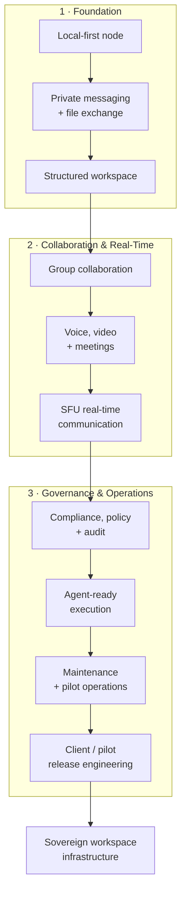
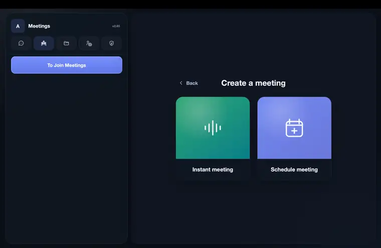

# ZNode

**Sovereign workspace infrastructure for organizations that need control over communications, collaboration, data, administration, and operational access.**

ZNode is Zetako's self-hosted workspace platform for private organizational communication and collaboration. It combines messaging, group spaces, meetings, voice/video, file storage, administrative controls, auditability, policy enforcement, compliance-oriented governance, and controlled support operations inside a deployable sovereign infrastructure.

This repository is the **public technical evidence layer for ZNode**.

It does **not** publish the proprietary production source code. Instead, it documents how ZNode is built, deployed, operated, measured, tested, secured, and governed. Over time this repository will contain reproducible benchmark reports, deployment measurements, capacity tests, SFU measurements, latency data, anonymized pilot observations, security-validation summaries, and product-engineering evidence.

**Zetako S.à r.l. · Luxembourg · [zetako.ai](https://zetako.ai/) · contact@zetako.ai**

---

## Product evolution at a glance

ZNode started as a private, self-hosted communication node and progressively evolved into a broader sovereign workspace infrastructure.

What matters is not only the feature set, but the **trajectory**: each layer added operational depth, stronger governance, and a clearer path toward enterprise-grade deployment.



**From a local communication node to a governed sovereign workspace:** communication → collaboration → real-time media → compliance → agent control → operations → deployment engineering.

For the detailed public milestone narrative, see [`docs/PRODUCT_EVOLUTION.md`](docs/PRODUCT_EVOLUTION.md).

---

## What ZNode is

ZNode is designed as a private workspace that an organization can operate under its own infrastructure and governance model.

Current product areas include:

- direct and group messaging;
- private group spaces;
- file storage and workspace collaboration;
- voice and video communication;
- meetings and meeting scheduling workflows;
- guest and external-user workflows where enabled;
- administrative roles and policy controls;
- audit and operational event records;
- compliance-oriented governance tooling;
- diagnostics and operator tooling;
- controlled support-access models;
- agent-ready infrastructure with scoped tool execution, action logging, and confirmation controls.

ZNode is developed as infrastructure rather than as a thin hosted front end. The public evidence in this repository is intended to make that distinction measurable.

---

## Product surfaces

> **Development environment — representative product surfaces.** These screenshots show an active ZNode development node and do not contain customer production data.

### Command Center


### Compliance Center


### Workspace


### Meetings



See [`docs/PRODUCT_SURFACES.md`](docs/PRODUCT_SURFACES.md) for the complete product-surface set, including **Messaging** and **Audit Logs**.

---

## Deployment scope — single-node by design

ZNode is intentionally designed as a **single-node sovereign workspace**.

The supported architecture is optimized for organizations that want one controlled deployment boundary rather than a horizontally distributed, multi-region SaaS platform.

A standard ZNode deployment is designed around:

- one customer-controlled node;
- one application runtime;
- local persistent application state;
- local filesystem-backed workspace data;
- SQLite for transactional application state;
- local or co-located communication and media services;
- a reverse-proxy / TLS boundary;
- explicit backup, recovery, maintenance, and support workflows.

This architecture is deliberate.

ZNode is **not** currently designed as a horizontally sharded SaaS service where many application workers concurrently write to a distributed database across multiple regions or nodes.

Within the supported single-node model, SQLite provides useful properties for sovereign infrastructure:

- no external database service dependency;
- low operational complexity;
- deterministic local ownership of application state;
- straightforward backup and recovery;
- compact deployment footprint;
- fewer infrastructure components to administer and secure.

The relevant engineering question is therefore not whether SQLite can support arbitrary hyperscale SaaS workloads. The relevant question is whether the **complete ZNode node** can support its defined user, messaging, workspace, meeting, governance, and operational workload on the supported deployment profile.

That capacity will be established through published load, latency, resource, and concurrency benchmarks.

> **Capacity figures in this repository apply to the supported single-node architecture. They should not be interpreted as claims about horizontally distributed, clustered, or multi-region deployments.**

---

## Validated engineering snapshot

The current engineering snapshot is based on repository inspection and local tooling against the active ZNode workspace.

| Metric | Current evidence |
|---|---:|
| Active product code | **285,103 active lines** across **671 files** |
| Automated test suite | **1,613 automated tests** |
| Test files | **134** |
| HTTP route surface | **327 routes** |
| WebSocket route surface | **2 routes** |
| Known Python dependency vulnerabilities | **0 detected** by `pip-audit` against `requirements.txt` |
| Agent tools exposed | **6 read-only tools** |
| Compliance export data types | **9 scoped data types** |
| Compliance case states | **6** |
| Supported production meeting profile | **10 participants per room** |
| z-connect HTTP rate-limit default | **60 req/s** |
| z-connect WebSocket rate-limit default | **120 messages/s** |
| Precompiled deployment example | **3 min 40 sec** — full environment report pending |

The active-line count excludes tests, documentation, reports, build output, distribution artifacts, `node_modules`, and caches. The test count represents the current automated test suite; detailed execution and category reports will be published separately.

The dependency result means that the dependency set resolved from `requirements.txt` had **no known vulnerabilities reported by the audit tool at the time of the scan**. It is not a blanket statement that the complete application has no vulnerabilities.

The **10-participant meeting figure is a supported production profile limit, not a measured concurrency ceiling**. Dedicated SFU capacity benchmarks will be published separately.

---

## What this repository will publish

### 1. Deployment evidence

ZNode deployment measurements will include:

- clean-host deployment time;
- deployment using precompiled artifacts;
- time to healthy services;
- restart and update behavior;
- host requirements;
- CPU, RAM, storage, and network prerequisites;
- deployment topology and service dependencies;
- rollback and recovery evidence where applicable.

The initial internally measured precompiled deployment example is **3 minutes 40 seconds**. A full report will document the exact host specification, included and excluded setup steps, artifact state, and health criteria.

See [`docs/DEPLOYMENT.md`](docs/DEPLOYMENT.md).

### 2. Performance and capacity

Future public reports will separate controlled benchmarks from real pilot observations.

Planned measurements include:

- API latency: p50 / p95 / p99;
- message-delivery latency;
- WebSocket connection and reconnection behavior;
- sustained messaging throughput;
- concurrent active users;
- file upload/download throughput;
- meeting creation and join latency;
- concurrent meeting-room capacity;
- SFU CPU and memory behavior;
- SFU bandwidth characteristics;
- media latency, jitter, and packet-loss observations where measurable;
- host CPU/RAM behavior at defined load levels.

ZNode already exposes request-level observability such as response timing, database query counts/timing, `Server-Timing`, request identifiers, and an admin-protected `/metrics` endpoint. Percentile benchmark publication will use real scenario samples rather than infer p50/p95/p99 from averages.

All capacity and performance reports must be interpreted within ZNode's **single-node supported deployment scope** and with the reference machine, runtime configuration, storage model, media settings, and network conditions stated explicitly.

See [`docs/METRICS_AND_BENCHMARKS.md`](docs/METRICS_AND_BENCHMARKS.md).

### 3. Pilot observations

ZNode pilots provide operational evidence that is different from a laboratory benchmark.

Where publication is appropriate and privacy-safe, this repository will publish **anonymized aggregate observations** such as:

- active users;
- sessions;
- messages;
- meetings;
- meeting minutes;
- file operations;
- storage use;
- API latency;
- request/error rates;
- CPU and memory utilization;
- service availability.

Pilot observations will always be labeled separately from controlled benchmark results.

---

## Deployment and operating modes

ZNode is designed to support different operational relationships between the customer and Zetako. The exact access rights and responsibilities depend on the deployment contract and configuration.

The public model distinguishes three operating modes:

### Client Mode

The organization operates ZNode as its own infrastructure. Zetako does not assume permanent operational access merely because the software is deployed.

Support access, when required, is intended to be explicit, controlled, and scoped to the support action being performed.

### Pilot Mode

A pilot deployment is operated for evaluation, validation, feedback, and engineering observation under agreed pilot conditions.

A pilot may permit Zetako to perform a broader set of operational and diagnostic actions than a fully customer-controlled production environment, but that access must remain defined by the pilot agreement and deployment configuration.

### Integrated Support Mode

Integrated support is intended for customers that explicitly choose an operational support relationship with Zetako.

The design goal is that **supportability should not require surrendering sovereignty**. Public documentation will describe how support access is authorized, scoped, logged, revoked, and separated from ordinary user activity.

See [`docs/OPERATING_MODES.md`](docs/OPERATING_MODES.md).

---

## Compliance Center and governance model

Sovereignty answers **where infrastructure and data are controlled**. Governance answers **how that environment is administered, evidenced, and reviewed**.

The current Compliance Center model includes **9 scoped exportable data types** covering messages, attachment metadata, file binaries, meetings, calls, calendar data, workspace permissions, audit events, and login events.

Compliance cases move through **6 defined states**: draft, pending approval, approved, export ready, closed, and rejected. Export generation requires the `admin:compliance` permission and second-administrator approval before scoped data is produced.

The conceptual model is:

```text
Policy
  ↓
Enforcement
  ↓
Evidence
  ↓
Review
```

ZNode does not claim that installing software automatically makes an organization compliant with a regulation or certification framework. Compliance depends on deployment, configuration, procedures, organizational responsibilities, legal context, and operational practice.

See [`docs/COMPLIANCE_CENTER.md`](docs/COMPLIANCE_CENTER.md).

---

## Security and testing

The current ZNode engineering suite contains **1,613 automated tests across 134 test files**.

Coverage represented in the repository includes authentication and route protection, permissions and ACLs, messaging, workspace, storage, meetings/RTC, browser workflows, database migrations, agent scopes and execution controls, deployment behavior, policy handling, and security regressions.

A dependency audit using `pip-audit` against `requirements.txt` reported **0 known dependency vulnerabilities** for the resolved dependency set at the time of the scan.

Security publications focus on defensive evidence: authentication controls, permission boundaries, session behavior, administrative isolation, auditability, regression coverage, dependency posture, and security-test methodology.

Sensitive exploit paths, credentials, internal secrets, and deployment-specific defensive details will not be published.

See [`docs/SECURITY_AND_TESTING.md`](docs/SECURITY_AND_TESTING.md).

---

## Agent-ready governance

ZNode includes an agent-ready architecture intended to let automated systems operate through explicit internal contracts rather than unrestricted application access.

The current public registry exposes **6 read-only tools**:

- `audit.search`;
- `calendar.list_events`;
- `meetings.list`;
- `messages.search`;
- `storage.search`;
- `users.list`.

The current default registry exposes **0 write tools**. Agent infrastructure also includes authenticated integrations, visible agent principals, execution controls, action ledgering, and confirmation-queue foundations for sensitive actions.

---

## How Zetako publishes metrics

Performance claims are easy to make misleading. ZNode therefore uses three labels for public measurements.

### MEASURED BENCHMARK

A controlled, reproducible test with named hardware, software version, workload, methodology, and measurement boundary.

### PILOT OBSERVATION

An anonymized observation from a real operating environment. Useful for understanding actual behavior, but not presented as a controlled benchmark.

### ARCHITECTURAL TARGET

A design objective, planned capacity, or expected scaling direction that has **not yet been validated as a measured result**.

Targets will never be presented as validated capacity.

**Scope note:** ZNode benchmark and capacity claims refer to the supported single-node architecture unless a report explicitly states otherwise.

---

## Evidence structure

```text
/
├── README.md
└── docs/
    ├── PRODUCT_SURFACES.md
    ├── PRODUCT_EVOLUTION.md
    ├── ARCHITECTURE.md
    ├── REFERENCE_DEPLOYMENT.md
    ├── DATA_AND_STORAGE_MODEL.md
    ├── ZNODE_OPERATING_MODEL.md
    ├── DEPLOYMENT.md
    ├── OPERATING_MODES.md
    ├── COMPLIANCE_CENTER.md
    ├── SECURITY_AND_TESTING.md
    ├── LIVE_LATENCY_BASELINE.md
    └── METRICS_AND_BENCHMARKS.md
```

Future additions are expected to include dedicated reports for:

- deployment benchmarks;
- infrastructure footprint;
- API latency;
- messaging performance;
- SFU and meeting capacity;
- storage/file throughput;
- pilot telemetry snapshots;
- reliability observations;
- security-test summaries;
- test-suite evolution;
- version-to-version engineering changes.

---

## Public vs. private

### Public in this repository

- product architecture at a non-sensitive level;
- deployment model and operating modes;
- benchmark methodology;
- validated performance/capacity reports;
- anonymized pilot metrics;
- security-validation summaries;
- test-suite statistics;
- compliance/governance model;
- technical diagrams and evidence;
- product surfaces and development screenshots;
- product evolution and engineering milestones.

### Private / controlled distribution

- proprietary ZNode source code;
- production credentials and secrets;
- customer data;
- customer-specific deployment details;
- sensitive security implementation details;
- internal operational tooling that would weaken security if disclosed;
- unpublished security findings;
- protected commercial and customer information.

---

## Publication principle

ZNode's public technical record follows a simple rule:

> **Measured claims should be inspectable. Unmeasured claims should be labeled as targets. Security evidence should increase trust without reducing security.**

This repository will grow with the product. The objective is not to publish every internal implementation detail, but to provide customers, partners, engineers, security teams, and investors with enough technical evidence to understand what ZNode can do and how those claims were established.

---

## About Zetako

**Zetako S.à r.l.** is a Luxembourg deep-tech company developing sovereign software infrastructure and proprietary data-compression technologies.

**Website:** [zetako.ai](https://zetako.ai/)  
**Contact:** contact@zetako.ai  
**Location:** Luxembourg

---

<sub>Performance and capacity figures in this repository represent specific environments, product versions, workloads, and measurement scopes. They must be interpreted together with their associated methodology. Public documentation does not grant rights to reproduce, reverse engineer, or redistribute ZNode's proprietary implementation.</sub>
