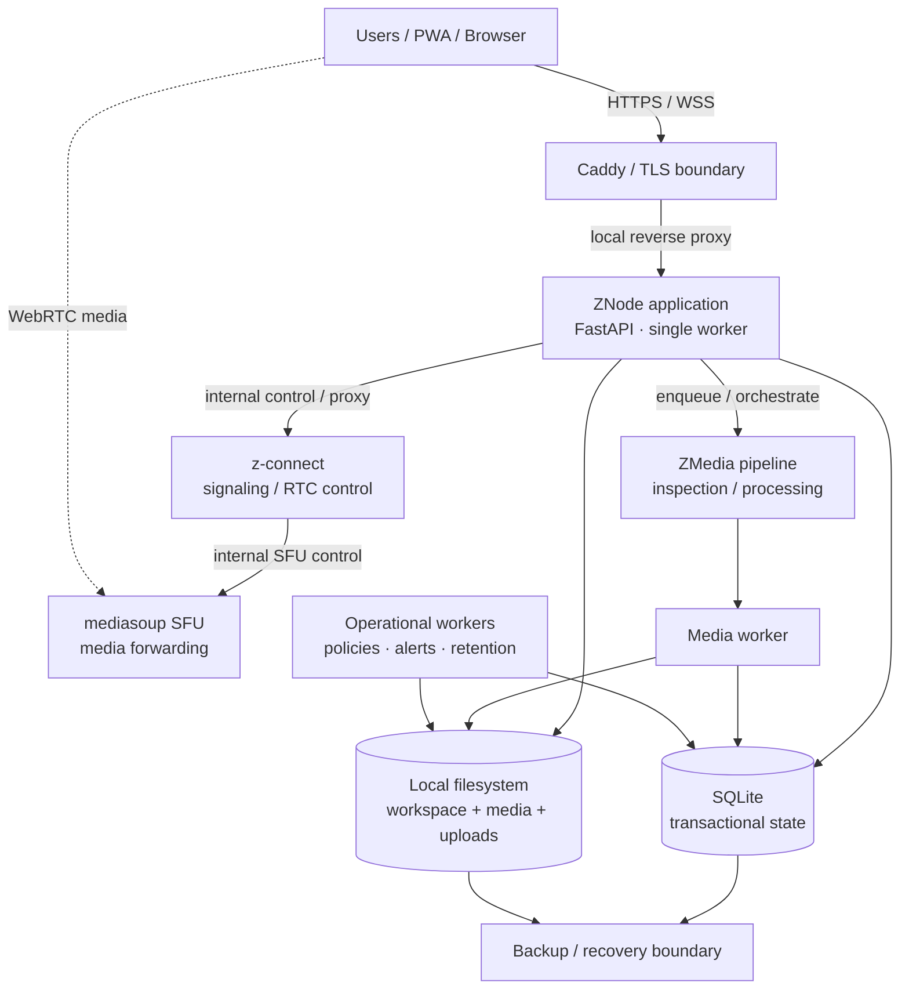
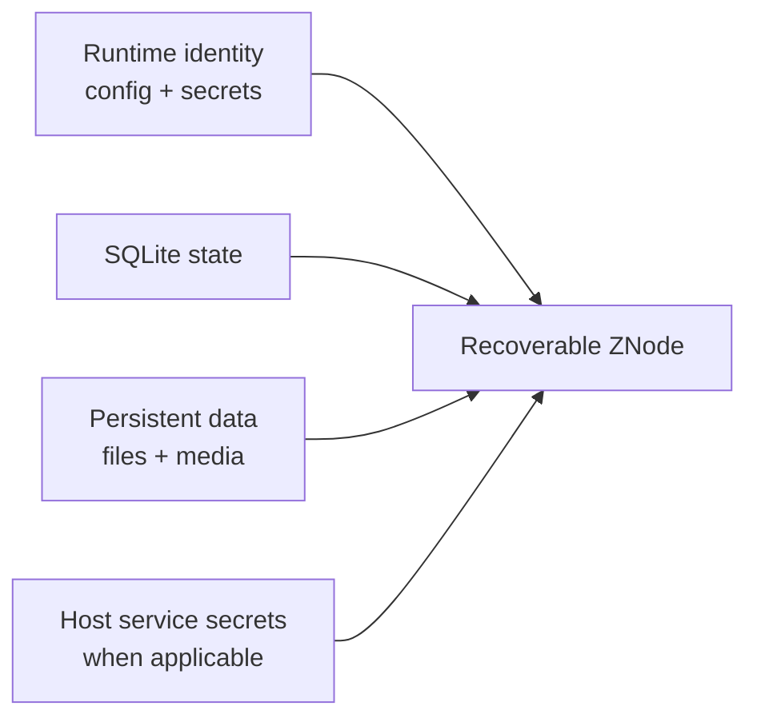

# ZNode Architecture

This document describes the current **single-node ZNode architecture** using the deployed `refactor` branch of the private ZNode repository as the source of truth.

The objective is to explain the architecture at a level suitable for customers, technical partners, security teams, and investors without publishing proprietary source code or sensitive deployment details.

ZNode is designed as a **single-node sovereign workspace**: one customer-controlled deployment boundary contains the application runtime, transactional state, local file storage, communication services, media processing, and operational workers.

---

## Node architecture at a glance



The diagram intentionally separates the **application plane**, the **real-time media plane**, and the **persistent data plane**.

---

## 1. Public boundary

In the supported Linux deployment model, **Caddy owns the public HTTPS/TLS boundary**.

The ZNode FastAPI application itself is kept on a local upstream, with the standard deployment using:

- application host: `127.0.0.1`;
- application port: `8000`;
- public traffic terminated and proxied by Caddy.

Caddy is responsible for the external HTTP(S) entry point and applies the deployment security headers and request-body limits before proxying requests to ZNode.

The intended request path is therefore:

```text
User / PWA
    ↓ HTTPS
Caddy / TLS
    ↓ local HTTP
ZNode FastAPI
```

ZNode is not designed to expose the FastAPI process directly to the public Internet in the supported production topology.

### Publicly reachable surfaces

Depending on configuration and enabled features, public-facing traffic can include:

- the ZNode web/PWA user interface;
- authenticated application APIs;
- public login and health routes;
- proxied WebSocket/RTC signaling paths;
- WebRTC media transport required by the SFU/TURN topology.

Administrative and metrics surfaces remain protected by ZNode authentication and authorization.

---

## 2. Application plane

The main ZNode application is a **Python FastAPI runtime**.

The deployed architecture intentionally enforces a **single FastAPI worker**. This is not accidental: parts of the current runtime include in-process state for maintenance, rate limiting, realtime state, and job coordination.

The application plane owns the organizational and governance state of the node, including areas such as:

- authentication and sessions;
- users, roles, and permissions;
- direct and group messaging;
- workspace metadata and permissions;
- meetings and call records;
- audit and security events;
- compliance workflows;
- settings and policies;
- agent principals, scopes, execution records, and confirmations;
- operational state and diagnostics.

The application runtime also exposes health and metrics instrumentation and coordinates background runtime maintenance.

---

## 3. Persistent data plane

ZNode uses a deliberately simple local persistence model:

```text
SQLite
    +
local filesystem
```

### SQLite

SQLite stores transactional application state and metadata.

This includes categories such as:

- users and authentication state;
- conversations and messages;
- call and meeting records;
- workspace metadata and ACLs;
- audit and security events;
- settings and governance state;
- background-job and operational records;
- agent and compliance records.

SQLite is used within the supported **single-node architecture**, where keeping application state local reduces external infrastructure dependencies and simplifies node ownership, backup, and recovery.

It is not presented as the database architecture for a horizontally sharded multi-region SaaS platform.

### Local filesystem

Binary and larger payload data is stored under the node runtime rather than embedded directly into application database rows.

Persistent filesystem areas include data such as:

- uploads;
- messaging files;
- workspace files;
- user media;
- chat media and generated media artifacts.

The runtime root used by the standard Linux deployment is:

```text
/var/lib/zetako-node
```

The supported deployment keeps writable runtime state inside this controlled node-owned boundary.

---

## 4. Real-time communication plane

Real-time communication is separated from the primary application runtime.

ZNode retains ownership of the application-level concepts — users, permissions, meetings, call records, and access decisions — while dedicated z-connect services handle RTC-specific behavior.

The supported deployment separates the following components:

### z-connect signaling / control service

A dedicated z-connect service handles signaling and RTC control-plane behavior.

The standard Linux deployment binds this service locally, with the managed default using:

```text
127.0.0.1:8010
```

ZNode communicates with the service through controlled internal integration/proxy paths rather than treating it as an independent public application.

### SFU sidecar

Group real-time media uses a dedicated **mediasoup SFU sidecar**.

The managed SFU control service is local to the node, with the standard internal endpoint using:

```text
127.0.0.1:8787
```

The SFU is a separate process with its own resource envelope because real-time media forwarding has different CPU, memory, networking, and failure characteristics from the main FastAPI application.

The supported production RTC profile is SFU-oriented by default.

### Application plane vs media plane

This separation is intentional:

| Application plane | Media plane |
|---|---|
| identity and permissions | WebRTC media transport |
| meeting/call records | RTP/media forwarding |
| governance and audit | SFU participant/media state |
| room authorization | bitrate / transport behavior |
| user workflow | real-time network path |

A failure or performance problem in the media plane can therefore be diagnosed separately from ordinary application/database latency.

---

## 5. Media processing plane

Uploaded media processing is not treated as arbitrary work inside the request path.

ZNode has a dedicated media-processing architecture with:

- ZMedia inspection/processing logic;
- media execution planning;
- FFmpeg-backed processing where required;
- persistent job state;
- a dedicated chat-media worker service.

The worker runs as a separate managed process and operates against the same node-owned runtime boundary.

This allows expensive media work to remain:

- bounded;
- observable;
- restartable;
- separated from normal API request handling.

Generated media artifacts remain inside the node's persistent storage boundary.

---

## 6. Operational workers

The deployed `refactor` architecture includes additional managed workers/timers for operational functions.

Examples include:

- media processing;
- policy processing;
- alert evaluation;
- memo processing/retention where enabled.

These are node-local managed services rather than a distributed external queue architecture.

The application and worker model is therefore consistent with the wider ZNode design principle:

> **Keep the operational unit understandable and self-contained inside one controlled node.**

Pilot-specific command and telemetry loops may also be enabled in Pilot deployments. They are deployment-mode capabilities and should not be interpreted as a requirement for a customer-controlled Client deployment.

---

## 7. What stays inside the node

The intended sovereignty boundary includes the core operational state required to run ZNode.

Within a standard node, the following remain local to the deployment unless an explicitly enabled integration changes that behavior:

- application database state;
- user and session records;
- message metadata and local message state;
- workspace metadata and files;
- uploaded files and user media;
- audit and governance records;
- compliance case state;
- agent action records;
- local operational jobs and diagnostics;
- media-processing artifacts;
- runtime identity/configuration material;
- z-connect/SFU control services.

This is the practical meaning of the single-node sovereignty model: the core application does not require an external managed database or external SaaS collaboration backend to function.

---

## 8. Local-only components

Several services are intentionally bound or operated as **local/internal node components**.

The standard deployment includes local upstreams such as:

- FastAPI ZNode application: `127.0.0.1:8000`;
- z-connect signaling/control service: local managed service, commonly `127.0.0.1:8010`;
- SFU control endpoint: local managed service, commonly `127.0.0.1:8787`.

These ports describe the standard internal topology, not additional public application endpoints.

Caddy is the main HTTP/TLS ingress boundary for the application-facing web path.

The actual WebRTC media plane may require network ports appropriate to the SFU/TURN configuration. Those media transports are distinct from exposing the application runtime itself.

---

## 9. Backup and recovery boundary

ZNode's recovery model mirrors the architecture boundary.

A **runtime identity backup** is intended to preserve the complete recoverable identity of a node and includes the essential runtime configuration, secrets, database, and persistent data directories.

The core recovery set includes:

```text
config/node.json
config/secrets.json
config/network_key.json

db/zetako_node.sqlite3

data/uploads/
data/messaging_files/
data/workspace_files/
data/user_media/
```

Application-data backup flows additionally cover configured application data areas such as chat media and associated database state.

Host/service-level environment files can exist outside the runtime root and must be protected through the host's configuration/secrets backup process when those services are enabled.

### Recovery principle

The recovery boundary is therefore:



A valid recovery requires compatible application software plus the original runtime identity, transactional state, persistent files, and the cryptographic material required to read protected payloads.

The supported baseline remains **single-node and local-disk-first**, so disaster recovery depends on maintaining verified off-node backup copies of this recovery set.

---

## 10. Security and trust boundaries

At a high level, ZNode separates trust into several layers:

```text
Internet / user device
        ↓
TLS / reverse-proxy boundary
        ↓
authenticated ZNode application boundary
        ↓
local services and persistent node state
```

Important boundaries include:

- Caddy terminates the supported public HTTPS path;
- FastAPI remains on a local upstream;
- administrative routes require application authorization;
- z-connect and SFU control services are separated from the main app runtime;
- filesystem payloads are accessed through controlled application workflows rather than arbitrary public directory exposure;
- backup archives are treated as sensitive operational material;
- runtime secrets and encryption keys are part of the node identity and recovery boundary.

This public document intentionally avoids publishing exploit-relevant configuration details or customer-specific topology.

---

## 11. Deployment profiles and architecture variation

The diagram above represents the **common single-node architecture**.

Some components vary by deployment mode:

### Client deployment

Customer-controlled production-oriented deployment. Pilot-specific telemetry or command capabilities are not assumed to be active.

### Pilot deployment

May enable explicitly scoped pilot enrollment, telemetry, and operational command capabilities for evaluation/support purposes.

### Integrated Support deployment

May enable controlled support operations according to the customer's chosen configuration and support agreement.

These modes change the operational relationship around the node; they do not change the core principle that ZNode is built around one controlled single-node deployment boundary.

---

## 12. Architecture principles

The current ZNode architecture follows several explicit principles:

1. **Single-node by design** — optimize for one understandable customer-controlled deployment boundary.
2. **Public ingress is separated from application runtime** — TLS/reverse proxy at the edge, app on local upstream.
3. **Local persistence first** — SQLite and filesystem state remain inside the node.
4. **Application and media planes are separated** — ordinary workspace traffic and real-time media have different processes and resource boundaries.
5. **Expensive background work is isolated** — media and operational jobs use managed workers rather than blocking normal request handling.
6. **Recovery mirrors runtime ownership** — configuration, secrets, transactional state, and persistent files define the recoverable node.
7. **Sovereignty does not remove governance** — access control, audit, policy, compliance, agent governance, and maintenance remain first-class parts of the architecture.

---

## Related public documentation

- [`PRODUCT_EVOLUTION.md`](PRODUCT_EVOLUTION.md) — how ZNode evolved into the current platform.
- [`DEPLOYMENT.md`](DEPLOYMENT.md) — public deployment evidence and measurement model.
- [`OPERATING_MODES.md`](OPERATING_MODES.md) — Client, Pilot, and Integrated Support boundaries.
- [`COMPLIANCE_CENTER.md`](COMPLIANCE_CENTER.md) — governance model.
- [`SECURITY_AND_TESTING.md`](SECURITY_AND_TESTING.md) — validation and security evidence.
- [`METRICS_AND_BENCHMARKS.md`](METRICS_AND_BENCHMARKS.md) — performance methodology and evidence.
- [`LIVE_LATENCY_BASELINE.md`](LIVE_LATENCY_BASELINE.md) — current external vs application latency baseline.

---

<sub>This document describes the public architecture boundary of the currently deployed ZNode `refactor` line. Internal implementation details, secrets, customer-specific configuration, and security-sensitive operational material remain private.</sub>
