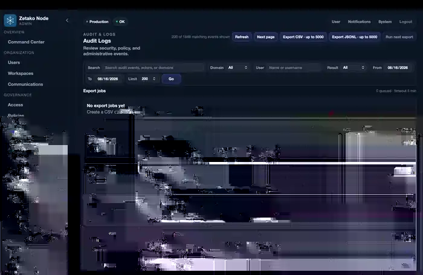

# ZNode Product Surfaces

> **Development environment — representative product surfaces.** These screenshots show an active ZNode development node and do not contain customer production data.

ZNode combines user collaboration, administrative control, governance, and operational visibility inside the same sovereign node. The screens below are representative views of the current development product.

## Command Center

The administrative Command Center provides an operational overview of node activity, connected accounts and sessions, live communications, alerts, and storage usage.

## Compliance Center

The Compliance Center provides documented case workflows and scoped eDiscovery search for governance and regulatory review.

## Audit Logs

Audit Logs provide a searchable event trail with filtering, event details, pagination, and controlled export workflows.

## Meetings

The Meetings surface supports direct creation of instant meetings and scheduled meeting workflows from the user workspace.

## Workspace

The Workspace surface provides local file and folder organization, workspace navigation, search, upload, and folder creation inside the node-controlled storage boundary.

## Messaging

The Messaging surface provides direct access to conversations and people within the organization, alongside the wider communication and workspace navigation model.

---

These screenshots are product evidence rather than benchmark evidence. Performance, capacity, security, architecture, and deployment claims are documented separately in the technical reports in this repository.
